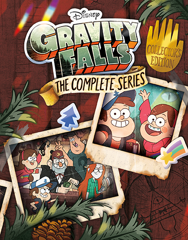

 
#Gravity Falls
 
 Amerykañski serial animowany, wchodz¹cy w kanon Disney Channel Original Series. Zosta³ on stworzony przez Alexa Hirscha. Swoj¹ premierê mia³ 15 czerwca 2012 w USA na kanale Disney Channel, a w Polsce 20 wrzeœnia 2012, równie¿ na Disney Channel.
 
###Fabu³a 
Plany rodzeñstwa Dippera i Mabel Pines zostaj¹ zrujnowane, gdy rodzice wysy³aj¹ ich do domku wujka Stana w Wodogrzmotach Ma³ych (Gravity Falls) w stanie Oregon, który prowadzi najdziwniejsze na œwiecie muzeum The Mystery Shack (Tajemnicza Chata), bêd¹ce w rzeczywistoœci turystyczn¹ pu³apk¹. Wkrótce Dipper i Mabel odkrywaj¹ jak tajemnicza jest miejscowoœæ ich zwariowanego wujka i próbuj¹ zrobiæ wszystko, by nauczyæ siê ¿yæ w Wodogrzmotach.

###Re¿yserowie:

<ul>
<li>John Aoshima</li>
<li>Aaron Springer</li>
<li>Joe Pitt</li>
</ul>

###Bohateriowie

<ol>
<li>*Mason "Dipper" Pines* - Brat bliŸniak Mabel, bystry, pomys³owy i ciekawy œwiata realista. Ma 12 lat i interesuje siê rozwi¹zywaniem zagadek.</li>
<li>*Mabel Pines* - Pe³na energii i optymizmu, choæ nieco szalona siostra bliŸniaczka Dippera. Potrafi znaleŸæ coœ pozytywnego w ka¿dej sytuacji, a robi to z szerokim, choæ niezbyt inteligentnym uœmiechem, który strasznie denerwuje jej brata. Mabel interesuje siê tym, czym inne dziewczyny w jej wieku, miêdzy innymi podrywaniem ch³opców, s³odyczami i muzyk¹. </li>
<li>*Stanley "Stanek" Pines* - wujek Dippera i Mabel, w³aœciciel Tajemniczej Chaty i jedna z najbardziej tajemniczych postaci serii. Ma dwóch braci - bliŸniaczego Stanforda i m³odszego Shermiego, który jest dziadkiem Dippera i Mabel. Wujek Stanek jest kanciarzem i oszustem, którego celem jest zdobywanie jak najwiêkszej iloœci pieniêdzy na turystach przychodz¹cych do jego pseudomuzeum ogl¹daæ tajemnicze, choæ tak naprawdê fa³szywe eksponaty. </li>
<li>**Jesus "Soos" Ramirez* - uroczy, teoretycznie doros³y, ale niezbyt dojrza³y 22-letni ch³opak pochodzenia hiszpañskiego. Od 12 roku ¿ycia za darmo pracuje w Tajemniczej Chacie. Jest najlepszym przyjacielem Dippera, zaœ Stanka uwa¿a za namiastkê ojca.</li>
<li>*Wendy Corduroy* - obiekt westchnieñ Dippera, rudow³osa 15-letnia dziewczyna pracuj¹ca w Tajemniczej Chacie. Pochodzi z rodziny drwali i umie dobrze pos³ugiwaæ siê siekier¹. 
</ol>

| Seria | Iloœæ odcinków | Premiera serii | Fina³ serii |
|-------|----------------|----------------|-------------|
| 1     | 20             | 15.06.2012     |  2.08.2013  |
| 2     | 21             | 1.08.2014      |  15.02.2016 |


[Tu mo¿esz obejrzeæ](https://www.netflix.com/watch/80017586?trackId=13752289&tctx=0%2C2%2Cad38671824f090fe5446f75004a7503187ec7daf%3A5c20880d2b90565051ac4c04d12ecbd04c42d76f%2C%2C) 

#Pozosta³e (nie w temacie)

  <blockquote>
    ggplot(data = mpg) +
    geom_histogram(mapping = aes(displ), bins = 15) +
    labs(title = "Pojemnoœci silnika", x = "Pojemnoœæ", y = "Liczba samochodów")
  </blockquote>

#Rstudio

```{r}
library(ggplot2)
ggplot(data = mpg, aes(x = class, y = displ)) +
  geom_boxplot() +
  coord_flip() +
  labs(title = "PojemnoϾ silnika w klasach", x = "Klasa", y = "PojemnoϾ silnika")
```

```{r}
library(tidyverse)
diamonds %>% filter(cut == "Good")
```

```{r}
library(tidyverse)
ggplot(data = mpg) +
  geom_bar(mapping = aes(x = class, fill = class)) +
  labs(title = "Number of cars in classes", x = "Class", y = "Number of cars")
```
